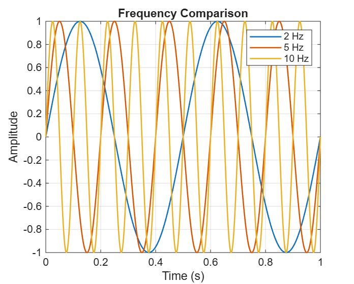
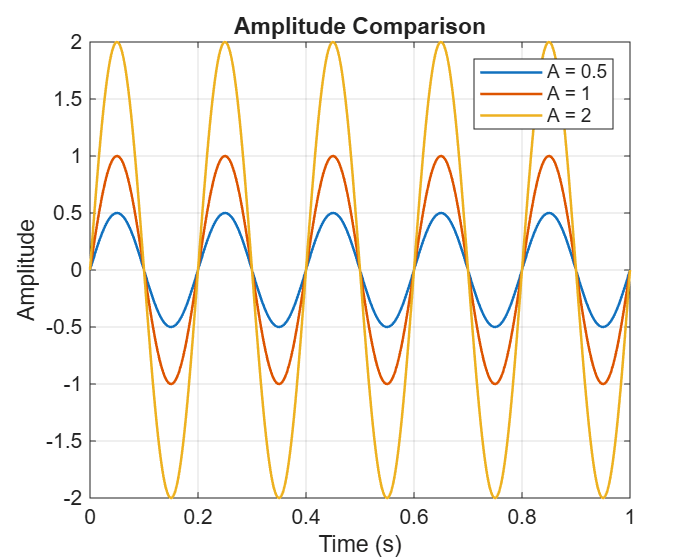
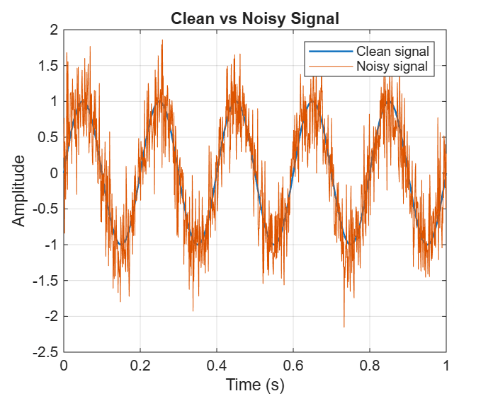

# DSP Assignment 1 - Visualizing Simple Signals in MATLAB

## Goal

The goal of this assignment is to learn how to create and visualize simple signals in MATLAB. I worked with frequency, amplitude, and noise.

## Frequency Comparison

I created sine waves with frequencies of 2 Hz, 5 Hz, and 10 Hz.

The signals have the same amplitude but different frequencies. In one second, the 2 Hz signal completes 2 cycles, the 5 Hz signal completes 5 cycles, and the 10 Hz signal completes 10 cycles.

I can see that when the frequency increases, the signal completes more cycles in the same amount of time.

## Amplitude Comparison

I created 5 Hz sine waves with amplitudes of 0.5, 1, and 2.

The signals have the same frequency, but their amplitudes are different. The signal with amplitude 2 has the largest peaks, while the signal with amplitude 0.5 has the smallest peaks.

Changing the amplitude changes the height of the signal, but it does not change its frequency.

## Clean vs Noisy Signal

I created a clean 5 Hz sine wave and added random noise to it.

The clean signal has a smooth sine-wave shape. After adding noise, the signal becomes irregular, but I can still see the original sine wave.

## Conclusion

In this assignment, I learned the difference between frequency and amplitude and saw how noise affects a signal. I also learned how to create and visualize simple signals using MATLAB.

## AI Usage

I used AI to help me understand some DSP concepts, explain parts of the MATLAB code, and organize the README.

I ran the MATLAB code myself and checked the graphs to make sure the results were correct.
